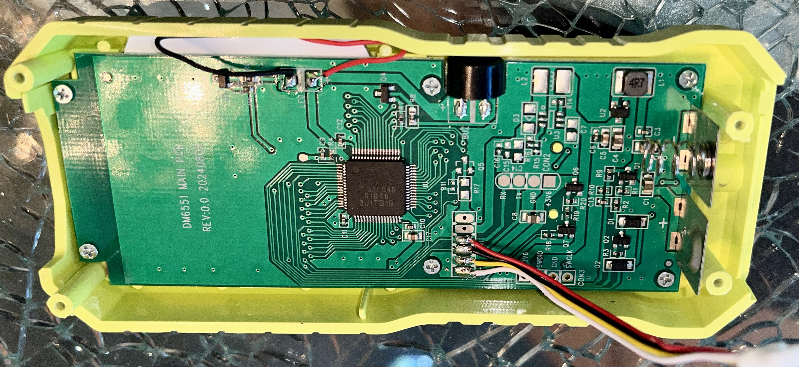

# Reverse engineering a laser measuring tape module

From [Amazon](https://www.amazon.ca/gp/product/B0DN5XTZYH), $20:

Contains a PCB with some ARM processor (guessing by the labelled SWDCK/SWDIO pads) and a separate laser measurement module.

## TL;DR: I just want to use it

The module uses a simple serial protocol. It requires 3.3V and communicates over a basic UART interface.

### Connector

It uses a little 4 pin connector which is likely JST-SH. If you consider the pin closest to the edge of the PCB as pin 1, the pinout is as follows:

| Pin  | Description               |
| ---- | ------------------------- |
| 1    | 3.3V (main PCB says 3.6V) |
| 2    | Ground                    |
| 3    | TXD (Module -> MCU)       |
| 4    | RXD (MCU -> Module)       |

### Protocol

It uses a very basic serial protocol where all data is sent as ASCII digits. The start of packet marker is 0x24 (`$`) and the end of packet marker is 0x26 (`&`). All packets appear to contain an even number of ASCII digits, which is important for the checksum algorithm. The last two ASCII digits in each packet form a checksum for the packet.

The serial setup is just 115200, 8 data bits, no parity and one stop bit. The UART signaling uses the normal "idle high" format.

| Packet               | Direction   | Description                                                  |
| -------------------- | ----------- | ------------------------------------------------------------ |
| `$0003260130&`       | to module   | Turns on the sighting laser                                  |
| `$0003260029&`       | to module   | Turns off the sighting laser                                 |
| `$00022123&`         | to module   | Take distance measurement                                    |
| `$000621xxxxxxxxyy&` | from module | The measurement result, `x` = distance in mm, `y` = checksum |
| `$00023335&`         | from module | command acknowledgement?                                     |

### Checksum Algorithm

This is one of the most ridiculous checksums I've run across. I figured it out by eyeballing the messages and a couple educated guesses:

1. Pair up the digits in the message to form values that each range from 0-99
2. Sum all these values
3. Take the answer and wrap it at 100

The last two digits of the message should equal the checksum.

e.g.

* `$00023335&`: 00 + 02 + 33 = 35, which is what the same as the last two digits of the message
* `$0003260130&`: 00 + 03 + 26 + 01 = 30
* `$0006210000001643&`: 00 + 06 + 21 + 00 + 00 + 00 + 16 = 43
* `$0006210000008815&`: 00 + 06 + 21 + 00 + 00 + 00 + 88 = 115, % 100 is 15

### Example code

I've included a [very basic Ardiuno script](./lasertape.ino) which drives the module to repeatedly take measurements and displays them on the serial port. It does not verify checksums. Note that you do not appear to need to issue the "laser on" or "laser off" commands; sending a "take measurement" command automatically turns the laser on and off as needed.

## Internal Photos

## Reverse-engineering the protocol

Apparently this wasn't strictly needed, as I later found a [similar module on Alibaba](https://www.alibaba.com/product-detail/RS232ttl-Serial-Laser-Rangefinder-Module-with_62507863905.html) which uses the same protocol. However the page does not appear to know about the checksum and includes other incorrect information (such as returninig a measurement and calling it a bad measurement):

## Data Captures

For all of these, the top line is module -> MCU, bottom line is MCU -> module. The communication is split up into multiple images partly for clarity, but also because there are long (500 - 5000ms) gaps between the MCU and module traffic.

### 0.239m

Decode: `$0003260130&` `$00023335&$0003261948&` `$00022123&` `$00023335&` `$0006210000011442&` 

Interesting that that second image seems to show two back-to-back responses from the module?

### 2.809m

Decode:`$00022123&` `$00023335&` `$0006210000268942&`

## laser on?

Decode: `$0003260130&` `$00023335&$0003262756&`

The second pic here also has two back-to-back responses.

### 1.919m

Decode: `$00022123&` `$00023335&` `$0006210000191965&`

I can actually see "1919" in that second image at the end.

### 1.3m

Decode: `$0003260130&` `$00023335&$0003264069&` `$00022123&` `$00023335&` `$0006210000130040&`

 I see 1.3 there in the last bit

### err500

Decode: `$00022123&` `$00023335&` `$00022123&` `$0003260029&` `$0006210000001643&`

### err255

Decode: `$0003260130&` `$000233356&$0003269625&` `$00022123&` `$00023335&`

### err261

Decode: `$0003260130&` `$00023335&$0003263059&` `$00022123&` `$00023335&`

### Unit is on, I briefly press the power button:

(do it again)

Decode (both are the same): `$0003260029&` `$000233356&$0003269625&`

(consistent command and response, not sure what its purpose is)

### 0.793m

## Conclusions

1. all commands and responses start with `$` and end with `&`
2. The last two digits in each message form a checksum.
3. The measurement time seems to vary from about a half second to a few seconds. I'm guessing that this depends on the actual distance, optical conditions of the environment as well as whatever internal processing the module does.
4. All unit conversion and fancy modes of operation are done by the MCU, not the module, which is a great thing.

My initial analysis was hampered by the unit defaulting to measuring the distance relative to the bottom of the device, rather than the top (where the "business end" of the measurement module is located). This explains why some of the captures above do not have a response value which equals the distance. Once I made sure the unit was set to measure from the top, the values the module provided over the UART always matched what was shown on the screen.
